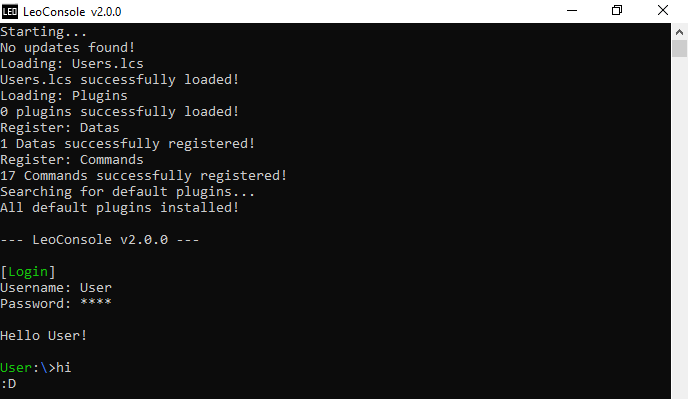

 # LeoConsole
LeoConsole is a terminal with many features!
It allows you to quickly and easily program smaller or larger console functions or use those of others.
It is written in C# 10 under .NET 6

## Getting Started
- [Install LeoConsole](https://github.com/BoettcherDasOriginal/LeoConsole/releases/latest)
- [LeoConsole Documentation](https://github.com/BoettcherDasOriginal/LeoConsole/wiki/Documetation)
- [Plugin Tutorial](https://github.com/BoettcherDasOriginal/LeoConsole/wiki)

## Overview

LeoConsole is a terminal with many features!
Multiple users, custom plugins, and a working directory are just a few of them.
Thanks to LeoConsole you can quickly and easily develop smaller console functions or use those of others.
With the functions provided by ILeoConsole, colored text output, auto-completion or automatic localization are very easy!

## Current News
- [LeoConsole v2.0.0 just released!](https://github.com/BoettcherDasOriginal/LeoConsole/discussions/36)

You can find all the news [here](https://github.com/BoettcherDasOriginal/LeoConsole/discussions/categories/news).

## Need help?
Check out the [wiki](https://github.com/BoettcherDasOriginal/LeoConsole/wiki)! 
Or open a new discussion!
